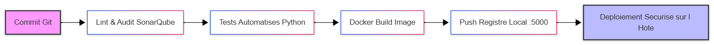

# Réponses au Questionnaire - Bloc BC02EC06

# Partie 1 : Questionnaire Technique

## 1. Emplacement de la pipeline GitHub Actions
Dans le dépôt `fluffy-octo-sniffle`, la définition des pipelines CI/CD se trouve par défaut à la racine du projet dans le dossier masqué `.github/workflows/`. Les pipelines y sont écrits sous la forme de fichier de configuration au format YAML (ex: `main.yml`).

## 2. Schéma du pipeline CI/CD
Voici le schéma conceptuel du pipeline mis en œuvre :

Le fichier source au format Mermaid (`pipeline.mmd`) est disponible à la racine du projet.

## 3. Reproduction de la pipeline avec Jenkins
Oui, il est tout à fait possible de reproduire la logique de cette pipeline avec Jenkins en traduisant la syntaxe YAML de GitHub Actions en un script Groovy (`Jenkinsfile`). Cependant, plusieurs informations cruciales sont manquantes dans le dépôt d'origine :
* **Les variables secrètes (Secrets) :** Les jetons d'authentification (tokens API), mots de passe de base de données ou clés privées SSH utilisés par GitHub Actions doivent être recréés manuellement dans le magasin d'identifiants sécurisés de Jenkins (*Credentials*).
* **Les Runners vs Agents :** GitHub fournit des environnements d'exécution managés (Ubuntu, Windows). Sous Jenkins, il faut associer explicitement des agents capables d'exécuter ces mêmes outils (par exemple, un agent disposant des binaires Docker et Python nécessaires).

## 4. Critique du fichier `compose.yaml` (Dépôt d'origine)
Plusieurs failles de conception et de sécurité majeures peuvent être relevées sur le fichier `compose.yaml` initial :
* **Absence de persistance (Volumes) :** Les données critiques (notamment celles de la base de données ou de SonarQube) ne sont pas associées à des volumes nommés persistants. En cas d'arrêt du conteneur, toutes les données sont définitivement perdues.
* **Secrets en clair :** Les mots de passe et identifiants d'accès aux bases de données sont injectés en texte brut (hardcoded) dans le fichier, ce qui contredit les bonnes pratiques de sécurité.
* **Exposition de ports excessive :** Trop de services exposent leurs ports directement sur la machine hôte (`0.0.0.0`), augmentant inutilement la surface d'attaque réseau au lieu de privilégier un réseau Docker privé et isolé.

## 5. Problématique du scaling de SonarQube
Nous allons rencontrer deux problèmes critiques :
* **Conflit de ports sur l'hôte :** Si le port réseau (ex: `9000`) est mappé de manière statique dans le fichier compose, le second conteneur refusera de démarrer pour cause de port déjà alloué.
* **Verrouillage et intégrité des données :** Sans une architecture de cluster adaptée et un système de fichiers partagé gérant les verrous ainsi qu'une base de données configurée pour le multi-connexions simultanées, les instances vont entrer en conflit, corrompre l'index de recherche et corrompre les données.

## 6. Communication entre plusieurs stacks Compose distinctes
Pour faire communiquer des services appartenant à des fichiers ou stacks "Compose" différents, il faut utiliser la notion de **Réseau Externe** 
`networks` avec la directive `external: true`.
Un réseau de base est créé par la stack principale, et la seconde stack vient s'y brancher explicitement.

## 7. Accès à une ressource de la machine hôte depuis un conteneur
Pour joindre un service qui tourne uniquement sur la machine hôte et non dans le réseau Docker, on utilise l'alias DNS spécial **`host.docker.internal`** associé à la configuration `extra_hosts` dans le fichier compose.

## 8. Établir un alias DNS complémentaire entre deux services
Pour définir un nom d'hôte alternatif, ou un alias, permettant à un service A de contacter un service B sous un autre nom sur un réseau commun, on utilise la directive **`aliases`** à l'intérieur de la section réseau du service concerné dans le fichier compose.

## 9. Remplacement de l'injection de valeurs dans une variable d'environnement
Pour éviter d'exposer des données sensibles dans les variables d'environnement, on peut remplacer l'injection directe par :
* L'utilisation de fichiers de configuration externes montés de manière sécurisée via des **Volumes** en lecture seule.
* L'utilisation native des **Docker Secrets** `secrets:` qui instancient des fichiers temporaires en mémoire `/run/secrets/` lisibles uniquement par le processus du conteneur.

## 10. Image Postgres personnalisée (Contrainte : 2 lignes)
```dockerfile
FROM postgres:latest
ENV POSTGRES_PASSWORD=mypassword
```


# Étape 9 : Étude des fonctionnalités de Rundeck et cas d'usage
Rundeck est un outil d'automatisation des opérations (Runbook Automation) orientée SysOps et Cyber. Elle centralise l'exécution de tâches sur des parcs de serveurs distants de manière hautement sécurisée.

Dans le cycle de vie de notre infrastructure CI/CD, Rundeck apporte une réelle valeur ajoutée sur les deux étapes clés suivantes :

### 1. Ordonnancement et Sécurisation du Déploiement (CD)
Plutôt que de confier à Jenkins des droits SSH d'administration totale sur nos serveurs de production pour exécuter des commandes Docker (ce qui représente un risque cyber élevé en cas de compromission de Jenkins), nous déléguons le déploiement final à Rundeck.
* **Mécanisme** : Une fois le build validé par Jenkins, ce dernier effectue un appel API vers Rundeck. Rundeck, qui centralise de manière ultra-sécurisée les clés SSH et contrôle les accès via des politiques ACL strictes, exécute le runbook de mise à jour (arrêt de l'ancien conteneur, récupération de la nouvelle image sur le registre local, déploiement et vérification des sondes de santé).
* **Avantage Cyber :** Cela permet de centraliser la gestion des clés SSH et des accès de déploiement dans Rundeck, sans exposer les accès de la machine hôte directement dans Jenkins.

### 2. Procédures de Rollback et Maintenance en Self-Service
En production, la détection d'une anomalie suite à un déploiement nécessite une réaction immédiate. Rundeck permet d'automatiser et de déléguer ces actions sans donner d'accès aux infrastructures sous-jacentes.
* **Mécanisme** : On associe à Rundeck un Job de "Rollback automatique" déclenchable par l'équipe support ou par une alerte de supervision. En un clic, Rundeck réinstalle la version précédente stable de l'image Docker située dans le registre local. De la même manière, Rundeck peut exécuter de façon autonome des tâches de maintenance régulières comme le nettoyage des images Docker obsolètes sur la machine hôte (docker system prune).
* **Avantage Opérationnel :** Les équipes peuvent diagnostiquer ou relancer l'application en un clic depuis Rundeck sans avoir besoin d'un accès SSH direct sur le serveur de production.